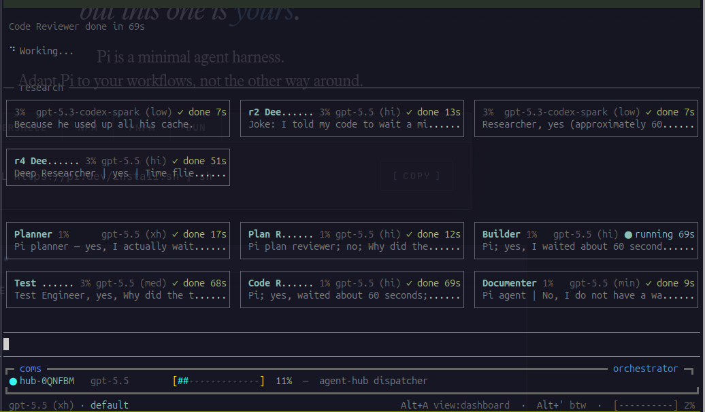
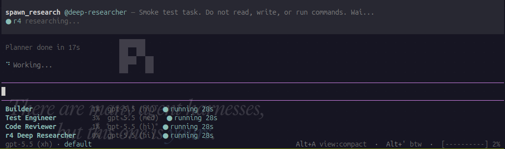

# Agent Skills

**Production-grade engineering skills for AI coding agents — plus a thin-context multi-agent harness for pi.**

Skills encode the workflows, quality gates, and best practices that senior engineers use when building software, packaged so AI agents follow them consistently across every phase of development. On **pi**, the [`agent-hub`](#agent-hub-a-multi-agent-harness-for-pi) harness runs those skills and personas as a live team of specialist subagents — while keeping the dispatcher's context thin.

```
  DEFINE          PLAN           BUILD          VERIFY         REVIEW          SHIP
 ┌──────┐      ┌──────┐      ┌──────┐      ┌──────┐      ┌──────┐      ┌──────┐
 │ Idea │ ───▶ │ Spec │ ───▶ │ Code │ ───▶ │ Test │ ───▶ │  QA  │ ───▶ │  Go  │
 │Refine│      │  PRD │      │ Impl │      │Debug │      │ Gate │      │ Live │
 └──────┘      └──────┘      └──────┘      └──────┘      └──────┘      └──────┘
  /spec          /plan          /build        /test         /review       /ship
```

---

## Commands

8 slash commands that map to the development lifecycle. Each one activates the right skills automatically.

| What you're doing | Command | Key principle |
|-------------------|---------|---------------|
| Define what to build | `/spec` | Spec before code |
| Plan how to build it | `/plan` | Small, atomic tasks |
| Build incrementally | `/build` | One slice at a time |
| Prove it works | `/test` | Tests are proof |
| Review before merge | `/review` | Improve code health |
| Simplify the code | `/code-simplify` | Clarity over cleverness |
| Ship to production | `/ship` | Faster is safer |
| Orchestrate a team | `/orchestrate` | Main session drives subagents |

`/orchestrate` turns the main session into an **orchestrator** that drives a config-defined team of subagents (default `planner` + `builder`, no reviewer), routing them as a runtime roster and handling the `NEEDS_RESEARCH` / `PLAN_FILE` handoffs. The named teams live in `.claude/orchestrate-teams.yaml` (mirroring pi's `.pi/agents/teams.yaml`) and are switchable at runtime: `/orchestrate <team> "<task>"`. It ships for **claude-code** and **opencode** (`/as-orchestrate`); pi orchestrates via the `agent-hub` harness instead.

Skills also activate automatically based on what you're doing — designing an API triggers `api-and-interface-design`, building UI triggers `frontend-ui-engineering`, and so on.

---

## agent-hub: a multi-agent harness for pi

`agent-hub` turns a single **pi** session into a **dispatcher that drives a live team of specialist subagents** — planner, builder, reviewer, test-engineer, documenter — with read-only research helpers fanning out beneath them, peer-to-peer `coms` messaging embedded, and a `damage-control` guardrail on every tool call.



What makes it different is what it **doesn't** put in front of the dispatcher LLM.

### Thin dispatcher context

Multi-agent setups usually drown the orchestrator: every subagent's output, every research dump, every verification note flows back into one context window until it compacts and forgets. `agent-hub` is built the other way around:

- **Research never enters the dispatcher context.** A specialist that lacks information ends its turn with `NEEDS_RESEARCH:` lines; the hub fans out read-only helpers, writes their findings to disk (`.pi/agent-sessions/findings/`), and resumes the specialist with the file paths. The dispatcher sees a one-line notice — never the raw findings.
- **The Verification Contract lives on disk.** The dispatcher owns a ledger of checkable acceptance assertions, built from the request *before* any builder runs and persisted to disk, rendered as a single status line (`Assertions: 2✓ 1○ 1✗ · open: A4`). A stated requirement is never silently dropped, and the contract survives compaction without re-flooding the context.
- **Specialists run `--no-extensions`.** Tools and credentials stay scoped to the subagent that needs them instead of leaking up into the dispatcher.

Every borrowed idea from another harness passes one test before it lands: *does this persistently enter the dispatcher context?* If yes, it goes to disk or a one-line status instead.

### What's in the box

- **Dispatcher grid** — a live dashboard of the fixed specialist team from `.pi/agents/teams.yaml`; `Alt+A` toggles the full dashboard and the compact view.
- **Specialist delegation** — `dispatch_agent` sends writable tasks to configured specialists; `/zoom` inspects a live timeline, and kill/restart manage running children.
- **Research helpers** — `spawn_research` / `/research` launch read-only recon: `researcher` on a fast spark model for simple reads, `deep-researcher` on a heavier model for hard, cross-cutting questions.
- **Verification Contract** — `set_assertions` / `update_assertion` / `get_assertions`, driven by the [`orchestrator`](agents/orchestrator.md) persona per the [orchestration-verification](skills/orchestration-verification/SKILL.md) skill.
- **Multi-model, multi-provider** — per-agent `model:` plus a `models:` switch list (`/agent-model <persona>`). Mix subscription and local models per role: cheap recon on a spark model, agentic work on a premium one.
- **Peer-to-peer coms** — the dispatcher is itself a `coms` node: hand a session off to another main agent, or use a peer as a subagent.



### Run it

```bash
just hub            # guarded dispatcher + research + coms + orchestrator persona
just hub-solo       # same, without the coms layer
just team-up full   # spawn addressable peers into tmux panes
```

`just hub` stacks the `damage-control-continue` guardrail (blocked calls feed back so the dispatcher adapts and keeps going) before `agent-hub`, and re-loads the hard-stop `damage-control` variant into spawned specialists. See the [pi extension catalog](docs/pi-extensions.md) for every harness, its setup, and the selective-load model.

---

## Quick Start

```bash
# In the workspace you want to configure:
npx @chankov/agent-skills init
# Then open your coding agent in this directory and run:
#   /setup-agent-skills
```

That's it for guided setup. `npx` fetches the package, the CLI detects your coding agent
(Claude Code, OpenCode, or pi), and `/setup-agent-skills` runs the full guided install —
analysing the workspace, showing grouped menus, and confirming everything
before writing a single file.

Main CLI commands:

| Command | What it does |
|---|---|
| `npx @chankov/agent-skills init` | Materialize the package + hand off to `/setup-agent-skills` |
| `npx @chankov/agent-skills doctor` | Scan for broken symlinks and stale persona refs |
| `npx @chankov/agent-skills update` | Surface the version delta + hand off to `/setup-agent-skills` for the per-artifact diff |
| `npx @chankov/agent-skills transform-persona` | Generate per-agent subagent files from the canonical personas (used by setup during apply) |

Versioned with [semver](https://semver.org); changelog in
[CHANGELOG.md](CHANGELOG.md); full docs in [docs/npm-install.md](docs/npm-install.md).

### Other install paths

<details>
<summary><b>Claude Code plugin marketplace</b> — best UX inside Claude Code</summary>

```
/plugin marketplace add chankov/agent-skills
/plugin install agent-skills@nc-agent-skills
```

> **SSH errors?** The marketplace clones repos via SSH. If you don't have SSH keys set up on GitHub, either [add your SSH key](https://docs.github.com/en/authentication/connecting-to-github-with-ssh/adding-a-new-ssh-key-to-your-github-account) or switch to HTTPS for fetches only:
> ```bash
> git config --global url."https://github.com/".insteadOf "git@github.com:"
> ```

</details>

<details>
<summary><b>Git clone + symlinks</b> — best for skill authors and contributors</summary>

```bash
git clone https://github.com/chankov/agent-skills.git
cd agent-skills
# In Claude Code:
claude --plugin-dir .
# Then run /setup-agent-skills in your target workspace and pick "symlink" in Step 8.
```

Updates flow through `git pull`. Symlinks need Developer Mode on Windows.

</details>

<details>
<summary><b>OpenCode</b></summary>

Uses agent-driven skill execution via `AGENTS.md` and the `skill` tool.

The repo also ships **optional** OpenCode slash commands in `.opencode/commands/` using an `as-` prefix as explicit lifecycle entry points (the agent will still invoke the same skills automatically from natural-language requests):

- `/as-spec`
- `/as-plan`
- `/as-build`
- `/as-test`
- `/as-review`
- `/as-orchestrate`
- `/as-code-simplify`
- `/as-ship`
- `/as-design-agent`

See [docs/opencode-setup.md](docs/opencode-setup.md).

</details>

<details>
<summary><b>pi</b></summary>

First-class pi package install:

```bash
pi install -l npm:@chankov/agent-skills
```

This includes the bundled `pi-ask-user` package, so the interactive `ask_user` tool and `ask-user` skill are available without a separate install.

pi has native Agent Skills support via `AGENTS.md` and discoverable skill directories like `.agents/skills/`. It can also expose the lifecycle commands (`/spec`, `/plan`, `/build`, `/test`, `/review`, `/code-simplify`, `/ship`) from `.pi/prompts/`, and pi extensions from `.pi/extensions/` (currently: `mcp-bridge`, `chrome-devtools-mcp`, `compact-and-continue`; one-time `npm ci` required — see setup doc). For clone/symlink setup, install `pi-ask-user` separately with `pi install -l npm:pi-ask-user` unless it is already listed by `pi list`. See [docs/pi-setup.md](docs/pi-setup.md).

The repo also ships selectable pi session *harnesses* — agent orchestration, safety auditing, and Pi-to-Pi messaging — ported or consolidated from [disler](https://github.com/disler)'s [`pi-vs-claude-code`](https://github.com/disler/pi-vs-claude-code) project (MIT). The flagship is [`agent-hub`](#agent-hub-a-multi-agent-harness-for-pi), the multi-agent dispatcher described above (`just hub`). See the [pi extension catalog](docs/pi-extensions.md) for the full list, setup, and how to run each one.

</details>

---

## All 24 Skills

The commands above are the entry points. Under the hood, they activate these 24 skills — each one a structured workflow with steps, verification gates, and anti-rationalization tables. You can also reference any skill directly.

### Define - Clarify what to build

| Skill | What It Does | Use When |
|-------|-------------|----------|
| [idea-refine](skills/idea-refine/SKILL.md) | Structured divergent/convergent thinking to turn vague ideas into concrete proposals | You have a rough concept that needs exploration |
| [spec-driven-development](skills/spec-driven-development/SKILL.md) | Write a PRD covering objectives, commands, structure, code style, testing, and boundaries before any code | Starting a new project, feature, or significant change |

### Plan - Break it down

| Skill | What It Does | Use When |
|-------|-------------|----------|
| [planning-and-task-breakdown](skills/planning-and-task-breakdown/SKILL.md) | Decompose specs into small, verifiable tasks with acceptance criteria and dependency ordering | You have a spec and need implementable units |

### Build - Write the code

| Skill | What It Does | Use When |
|-------|-------------|----------|
| [incremental-implementation](skills/incremental-implementation/SKILL.md) | Thin vertical slices - implement, test, verify, commit. Feature flags, safe defaults, rollback-friendly changes | Any change touching more than one file |
| [test-driven-development](skills/test-driven-development/SKILL.md) | Red-Green-Refactor, test pyramid (80/15/5), test sizes, DAMP over DRY, Beyonce Rule, browser testing | Implementing logic, fixing bugs, or changing behavior |
| [context-engineering](skills/context-engineering/SKILL.md) | Feed agents the right information at the right time - rules files, context packing, MCP integrations | Starting a session, switching tasks, or when output quality drops |
| [source-driven-development](skills/source-driven-development/SKILL.md) | Ground every framework decision in official documentation - verify, cite sources, flag what's unverified | You want authoritative, source-cited code for any framework or library |
| [frontend-ui-engineering](skills/frontend-ui-engineering/SKILL.md) | Component architecture, design systems, state management, responsive design, WCAG 2.1 AA accessibility | Building or modifying user-facing interfaces |
| [api-and-interface-design](skills/api-and-interface-design/SKILL.md) | Contract-first design, Hyrum's Law, One-Version Rule, error semantics, boundary validation | Designing APIs, module boundaries, or public interfaces |

### Verify - Prove it works

| Skill | What It Does | Use When |
|-------|-------------|----------|
| [browser-testing-with-devtools](skills/browser-testing-with-devtools/SKILL.md) | Chrome DevTools MCP for live runtime data - DOM inspection, console logs, network traces, performance profiling | Building or debugging anything that runs in a browser |
| [debugging-and-error-recovery](skills/debugging-and-error-recovery/SKILL.md) | Five-step triage: reproduce, localize, reduce, fix, guard. Stop-the-line rule, safe fallbacks | Tests fail, builds break, or behavior is unexpected |

### Review - Quality gates before merge

| Skill | What It Does | Use When |
|-------|-------------|----------|
| [code-review-and-quality](skills/code-review-and-quality/SKILL.md) | Five-axis review, change sizing (~100 lines), severity labels (Nit/Optional/FYI), review speed norms, splitting strategies | Before merging any change |
| [code-simplification](skills/code-simplification/SKILL.md) | Chesterton's Fence, Rule of 500, reduce complexity while preserving exact behavior | Code works but is harder to read or maintain than it should be |
| [security-and-hardening](skills/security-and-hardening/SKILL.md) | OWASP Top 10 prevention, auth patterns, secrets management, dependency auditing, three-tier boundary system | Handling user input, auth, data storage, or external integrations |
| [performance-optimization](skills/performance-optimization/SKILL.md) | Measure-first approach - Core Web Vitals targets, profiling workflows, bundle analysis, anti-pattern detection | Performance requirements exist or you suspect regressions |

### Ship - Deploy with confidence

| Skill | What It Does | Use When |
|-------|-------------|----------|
| [git-workflow-and-versioning](skills/git-workflow-and-versioning/SKILL.md) | Trunk-based development, atomic commits, change sizing (~100 lines), the commit-as-save-point pattern | Making any code change (always) |
| [ci-cd-and-automation](skills/ci-cd-and-automation/SKILL.md) | Shift Left, Faster is Safer, feature flags, quality gate pipelines, failure feedback loops | Setting up or modifying build and deploy pipelines |
| [deprecation-and-migration](skills/deprecation-and-migration/SKILL.md) | Code-as-liability mindset, compulsory vs advisory deprecation, migration patterns, zombie code removal | Removing old systems, migrating users, or sunsetting features |
| [documentation-and-adrs](skills/documentation-and-adrs/SKILL.md) | Architecture Decision Records, API docs, inline documentation standards - document the *why* | Making architectural decisions, changing APIs, or shipping features |
| [shipping-and-launch](skills/shipping-and-launch/SKILL.md) | Pre-launch checklists, feature flag lifecycle, staged rollouts, rollback procedures, monitoring setup | Preparing to deploy to production |

### Orchestrate - Keep multi-agent runs honest

| Skill | What It Does | Use When |
|-------|-------------|----------|
| [orchestration-verification](skills/orchestration-verification/SKILL.md) | The Verification Contract — dispatcher-owned acceptance assertions, a parity/touchpoint inventory for "behave like X" requests, structured upward returns with named evidence, and a requirement-regression reset | Orchestrating specialists through a dispatcher (the `agent-hub` harness / `orchestrator` persona), a "make X behave like existing Y" change, or a requirement that keeps coming back wrong |

This skill is the single canonical source for the four Verification-Contract artifacts. It is referenced — never restated — by the [`orchestrator`](agents/orchestrator.md) persona (which drives the [agent-hub harness](.pi/harnesses/agent-hub/), loaded by default via `just hub`), and conditionally by the [`builder`](agents/builder.md), [`test-engineer`](agents/test-engineer.md), and [`code-reviewer`](agents/code-reviewer.md) personas, whose structured returns report assertion status with evidence when the skill is installed.

---

## Agent Personas

14 pre-configured specialist personas live in [agents/](agents/) — reusable subagent definitions your coding agent can delegate work to. Each persona is one Markdown file with YAML frontmatter; the canonical format is pi-flavored, and the setup commands transform it per target agent on install (see [Installing personas](#installing-personas)).

| Persona | Role | Access | Primary skill | Agents |
|---|---|---|---|---|
| [planner](agents/planner.md) | Architect — writes dependency-ordered PLAN files with acceptance criteria | rw (plan file only) | [planning-and-task-breakdown](skills/planning-and-task-breakdown/SKILL.md) | all |
| [plan-reviewer](agents/plan-reviewer.md) | Plan critic — stress-tests plans for gaps, ordering, feasibility | read-only | [planning-and-task-breakdown](skills/planning-and-task-breakdown/SKILL.md) | all |
| [builder](agents/builder.md) | Implementer — lands changes in small verifiable increments | rw | [incremental-implementation](skills/incremental-implementation/SKILL.md) | all |
| [code-reviewer](agents/code-reviewer.md) | Senior staff engineer — five-axis review before merge | read-only | [code-review-and-quality](skills/code-review-and-quality/SKILL.md) | all |
| [test-engineer](agents/test-engineer.md) | QA — test strategy, coverage analysis, the Prove-It pattern | rw | [test-driven-development](skills/test-driven-development/SKILL.md) | all |
| [security-auditor](agents/security-auditor.md) | Security engineer — vulnerability detection, threat modeling, OWASP | read-only | [security-and-hardening](skills/security-and-hardening/SKILL.md) | all |
| [documenter](agents/documenter.md) | Tech writer — READMEs, inline docs, usage examples | rw | [documentation-and-adrs](skills/documentation-and-adrs/SKILL.md) | all |
| [architect](agents/architect.md) | System architect — design decisions and migration strategy | rw | [api-and-interface-design](skills/api-and-interface-design/SKILL.md) | all |
| [releaser](agents/releaser.md) | Release owner — changeset → version-bump → tag flow | rw | [git-workflow-and-versioning](skills/git-workflow-and-versioning/SKILL.md), [shipping-and-launch](skills/shipping-and-launch/SKILL.md) | all |
| [researcher](agents/researcher.md) | Fast read-only recon — reports findings with file:line citations | read-only | — | all |
| [deep-researcher](agents/deep-researcher.md) | Deep recon for hard, cross-cutting questions | read-only | — | all |
| [bowser](agents/bowser.md) | Headless browser automation via Playwright CLI | rw | — | pi only |
| [web-debugger](agents/web-debugger.md) | Interactive headful Chrome debugging via Chrome DevTools MCP (coms peer) | rw | [browser-testing-with-devtools](skills/browser-testing-with-devtools/SKILL.md) | pi only |
| [orchestrator](agents/orchestrator.md) | Verification-Contract agent-hub dispatcher — owns acceptance assertions, parity inventory, runtime-proof gate | — | [orchestration-verification](skills/orchestration-verification/SKILL.md) | pi only |

### How personas connect to skills

Personas are the *who*, skills are the *how*. Each working persona carries a conditional hook to its primary skill: if `skills/<skill-name>/SKILL.md` exists in the repo it is working on, the persona reads it before starting and follows its process and output format. Install the matching skill alongside the persona to get the full structured workflow — without it, the persona still works on its built-in rules. The research personas and `bowser` deliberately carry no skill hook (recon must stay lean; the orchestration prompt is built by agent-hub). The single `orchestrator` is the exception: it references [`orchestration-verification`](skills/orchestration-verification/SKILL.md) for the acceptance-assertion, parity-inventory, and structured-return formats of the Verification Contract it enforces. Several personas also honour the per-project overrides in `.ai/agent-skills-overrides.md` — e.g. `planner` writes its plan where `## planning-and-task-breakdown` says, and reviewers validate against the project's `rules:` folders.

### Installing personas

`/setup-agent-skills` offers every persona available for the chosen agent and installs it to the right place, transforming the frontmatter deterministically (via `npx @chankov/agent-skills transform-persona`):

| Agent | Installed to | Transformation |
|---|---|---|
| Claude Code | `.claude/agents/<name>.md` | tools renamed (`read→Read`, `find/ls→Glob`, …), model mapped to `opus`/`sonnet`/`haiku`, agent-hub keys dropped |
| OpenCode | `.opencode/agent/<name>.md` | `mode: subagent` added, write-capable tools denied per persona, agent-hub keys dropped |
| pi | `agents/<name>.md` | none — the canonical format is the pi format |

When this repo is installed as a Claude Code plugin, the `agents/` directory is auto-discovered — every non-pi-only persona is immediately available as a subagent without a separate install.

### Teams of subagents

The personas are designed to be composed, not used one at a time:

- **pi (agent-hub harness)** — the dispatcher spawns personas as specialist subagents. Named teams in [.pi/agents/teams.yaml](.pi/agents/teams.yaml) scope which personas it may use: `default` (plan → build → review → document), `debug`, `info`, and `frontend`. `just team-up <name>` instead spawns the [peers.yaml](.pi/agents/peers.yaml) personas (`architect`, `releaser`) as standalone, addressable peers in tmux panes. Personas with a `subagents:` block (e.g. `code-reviewer`'s `preflight`/`quality`/`perf`/`docs`) additionally delegate slices of their own job to pre-configured children.
- **Claude Code** — installed personas are native subagents: the main agent delegates to them automatically based on their `description`, or you invoke one explicitly ("use the code-reviewer subagent on this diff"). Chain them along the lifecycle: `/plan` work goes to `planner`, then `plan-reviewer` critiques, `builder` implements, and `code-reviewer` + `security-auditor` gate the merge.
- **OpenCode** — installed personas are subagents (`mode: subagent`): mention one with `@<name>` to invoke it directly, or let the primary agent delegate to it by description.

---

## Reference Checklists

Quick-reference material that skills pull in when needed:

| Reference | Covers |
|-----------|--------|
| [testing-patterns.md](references/testing-patterns.md) | Test structure, naming, mocking, React/API/E2E examples, anti-patterns |
| [security-checklist.md](references/security-checklist.md) | Pre-commit checks, auth, input validation, headers, CORS, OWASP Top 10 |
| [performance-checklist.md](references/performance-checklist.md) | Core Web Vitals targets, frontend/backend checklists, measurement commands |
| [accessibility-checklist.md](references/accessibility-checklist.md) | Keyboard nav, screen readers, visual design, ARIA, testing tools |

---

## How Skills Work

Every skill follows a consistent anatomy:

```
┌─────────────────────────────────────────────┐
│  SKILL.md                                   │
│                                             │
│  ┌─ Frontmatter ─────────────────────────┐  │
│  │ name: lowercase-hyphen-name           │  │
│  │ description: Use when [trigger]       │  │
│  └───────────────────────────────────────┘  │
│                                             │
│  Overview         → What this skill does    │
│  When to Use      → Triggering conditions   │
│  Process          → Step-by-step workflow   │
│  Rationalizations → Excuses + rebuttals     │
│  Red Flags        → Signs something's wrong │
│  Verification     → Evidence requirements   │
└─────────────────────────────────────────────┘
```

**Key design choices:**

- **Process, not prose.** Skills are workflows agents follow, not reference docs they read. Each has steps, checkpoints, and exit criteria.
- **Anti-rationalization.** Every skill includes a table of common excuses agents use to skip steps (e.g., "I'll add tests later") with documented counter-arguments.
- **Verification is non-negotiable.** Every skill ends with evidence requirements - tests passing, build output, runtime data. "Seems right" is never sufficient.
- **Progressive disclosure.** The `SKILL.md` is the entry point. Supporting references load only when needed, keeping token usage minimal.

---

## Per-Project Overrides

A few skills and the pi `agent-hub` harness need project-specific facts — where specs and plans are saved, how to start a dev server, whether the agent may create branches, or which user-facing language the dispatcher should use. Sensible defaults are built in, but any project can override them with a single file at `.ai/agent-skills-overrides.md`:

| Reader | What you can override |
|--------|----------------------|
| `spec-driven-development` | Spec output directory and naming |
| `planning-and-task-breakdown` | Plan output directory, naming, embedded vs separate todo |
| `browser-testing-with-devtools` | Dev-server command, base URL, auth flow and roles (required — no default) |
| `git-workflow-and-versioning` | Whether the agent may create branches (default: never) |
| `agent-hub` (legacy `## agent-team`) | Dispatcher user-facing language (default: English) |

See [docs/agent-skills-setup.md](docs/agent-skills-setup.md) for the file format and a copy-paste template.

---

## Project Structure

```
agent-skills/
├── skills/                            # 24 core skills (SKILL.md per directory)
│   ├── idea-refine/                   #   Define
│   ├── spec-driven-development/       #   Define
│   ├── planning-and-task-breakdown/   #   Plan
│   ├── incremental-implementation/    #   Build
│   ├── context-engineering/           #   Build
│   ├── source-driven-development/     #   Build
│   ├── frontend-ui-engineering/       #   Build
│   ├── test-driven-development/       #   Build
│   ├── api-and-interface-design/      #   Build
│   ├── browser-testing-with-devtools/ #   Verify
│   ├── debugging-and-error-recovery/  #   Verify
│   ├── code-review-and-quality/       #   Review
│   ├── code-simplification/          #   Review
│   ├── security-and-hardening/        #   Review
│   ├── performance-optimization/      #   Review
│   ├── git-workflow-and-versioning/   #   Ship
│   ├── ci-cd-and-automation/          #   Ship
│   ├── deprecation-and-migration/     #   Ship
│   ├── documentation-and-adrs/        #   Ship
│   ├── shipping-and-launch/           #   Ship
│   ├── orchestration-verification/    #   Orchestrate
│   ├── designing-agents/              #   Meta: author skills/personas/harnesses
│   ├── guided-workspace-setup/        #   Onboard
│   └── using-agent-skills/            #   Meta: how to use this pack
├── agents/                            # 14 reusable agent personas
├── references/                        # 4 supplementary checklists
├── hooks/                             # Session lifecycle hooks
├── .claude/commands/                  # 8 Claude slash commands
├── .pi/prompts/                       # 7 pi prompt-template commands
├── .pi/harnesses/                     # Selectable pi session harnesses (agent-hub, coms, damage-control)
└── docs/                              # Setup guides per tool
```

---

## Why Agent Skills?

AI coding agents default to the shortest path - which often means skipping specs, tests, security reviews, and the practices that make software reliable. Agent Skills gives agents structured workflows that enforce the same discipline senior engineers bring to production code.

Each skill encodes hard-won engineering judgment: *when* to write a spec, *what* to test, *how* to review, and *when* to ship. These aren't generic prompts - they're the kind of opinionated, process-driven workflows that separate production-quality work from prototype-quality work.

Skills bake in best practices from Google's engineering culture — including concepts from [Software Engineering at Google](https://abseil.io/resources/swe-book) and Google's [engineering practices guide](https://google.github.io/eng-practices/). You'll find Hyrum's Law in API design, the Beyonce Rule and test pyramid in testing, change sizing and review speed norms in code review, Chesterton's Fence in simplification, trunk-based development in git workflow, Shift Left and feature flags in CI/CD, and a dedicated deprecation skill treating code as a liability. These aren't abstract principles — they're embedded directly into the step-by-step workflows agents follow.

---

## Contributing

Skills should be **specific** (actionable steps, not vague advice), **verifiable** (clear exit criteria with evidence requirements), **battle-tested** (based on real workflows), and **minimal** (only what's needed to guide the agent).

See [docs/skill-anatomy.md](docs/skill-anatomy.md) for the format specification and [CONTRIBUTING.md](CONTRIBUTING.md) for guidelines.

---

## License

MIT - use these skills in your projects, teams, and tools.
